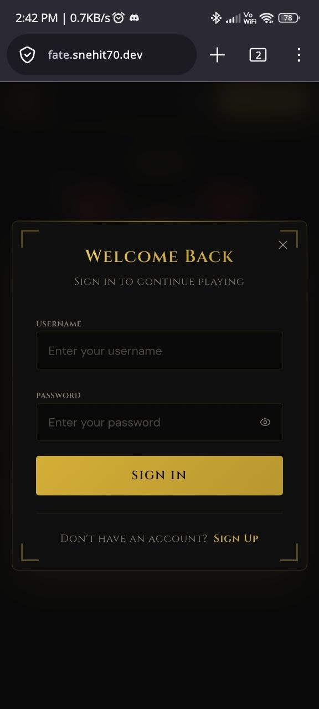
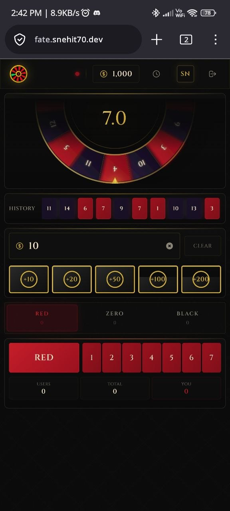
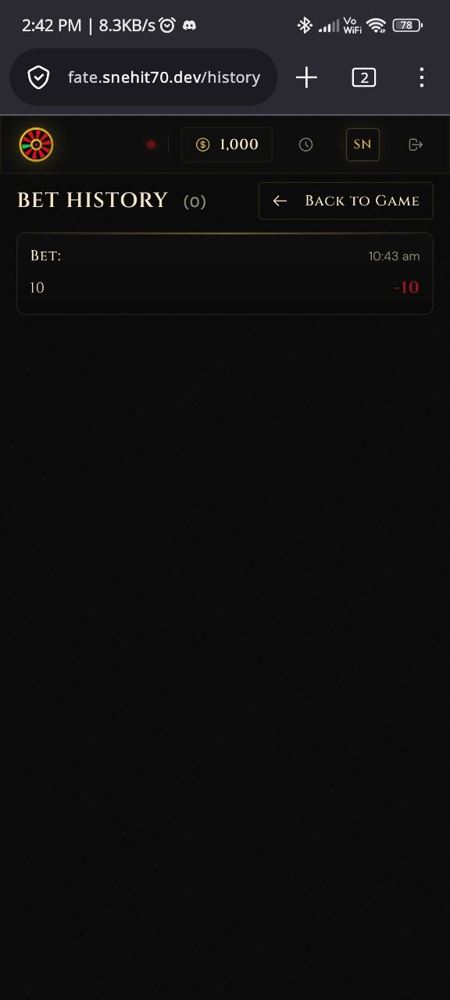

# FateWheel

FateWheel is a real-time roulette-style betting game with a Vue 3 client and a
TypeScript/Express backend. Players place bets during a timed round, watch a
synchronized wheel spin, and receive payouts when the round settles. Admins can
manage player balances, review rounds and logs, and withdraw net profit.

## Stack

- **Client:** Vue 3, Vite, Pinia, Vue Router, Socket.IO client, Tailwind CSS
- **Server:** Node.js 22+, Express, TypeScript, Socket.IO, Mongoose
- **Data:** MongoDB required; Redis optional for multi-instance state, pub/sub,
  Socket.IO adapter, leader election, and shared rate limiting
- **Tests:** Jest, ts-jest, mongodb-memory-server, Supertest

## Features

- Live round lifecycle: betting, spinning, result display, and settlement
- Real-time state sync over Socket.IO, including late-join round state
- Number, color, and even/odd bets with configurable limits and payout
  multipliers
- JWT authentication with player and admin roles
- Admin dashboard for players, balances, logs, rounds, round details, stats, and
  withdrawals
- Player history with pagination and date or round filtering
- Optional Redis-backed horizontal scaling
- Structured logging with rotating log files

## Screenshots

### Sign In



### Game



### Bet History



## Requirements

- Node.js `>=22.0.0`
- npm `>=10`
- Podman and `lsof` if you use `./run.sh`
- MongoDB, either local or containerized
- Redis only when `REDIS_URL` is configured

## Environment Setup

Create local env files from the examples:

```bash
cp server/.env.example server/.env
cp client/.env.example client/.env
```

At minimum, set these in `server/.env`:

```bash
MONGO_URL=mongodb://127.0.0.1:27017/fatewheel
JWT_SECRET=replace_with_a_strong_secret
CLIENT_URL=http://localhost:5173
ADMIN_USERNAME=admin
ADMIN_PASSWORD=replace_with_a_secure_password
```

The client defaults to the local API and socket server:

```bash
VITE_API_URL=http://localhost:3000/api
VITE_SOCKET_URL=http://localhost:3000
```

Keep game config aligned between `server/.env` and `client/.env` when changing
bet limits, payouts, or phase durations.

## Run Locally

The launcher checks whether ports `3000` and `5173` are already in use before it
starts anything.

```bash
./run.sh
```

This script:

- starts or creates a Podman MongoDB container named `mongodb`
- seeds the admin account from `ADMIN_USERNAME` and `ADMIN_PASSWORD`
- runs the server test suite
- starts the backend on `http://localhost:3000`
- starts the frontend on `http://localhost:5173`
- writes logs to `logs/backend.log` and `logs/frontend.log`

Stop the local app:

```bash
./stop.sh
```

## Manual Development

Install dependencies:

```bash
cd server && npm install
cd ../client && npm install
```

Start MongoDB if needed:

```bash
podman run -d --name mongodb -p 27017:27017 mongo:latest
```

Seed the admin account:

```bash
cd server
npm run seed:admin
```

Run the backend:

```bash
cd server
npm run dev
```

Run the client in another terminal:

```bash
cd client
npm run dev
```

## Scripts

Server scripts:

```bash
npm run dev              # watch TypeScript server with tsx
npm run build            # compile to dist/
npm run start            # run compiled dist/index.js
npm run typecheck        # TypeScript check without emit
npm test                 # Jest test suite
npm run test:coverage    # Jest with coverage
npm run seed:admin       # create/update configured admin account
npm run migrate:balances # backup and migrate player balances
npm run rollback:balances
```

Client scripts:

```bash
npm run dev      # Vite dev server
npm run build    # production build
npm run preview  # preview production build
npm run lint     # placeholder; no linter configured yet
```

## API Overview

Base URL: `http://localhost:3000`

- `GET /health`
- `GET /api/game/healthz`
- `POST /api/auth/register`
- `POST /api/auth/login`
- `GET /api/auth/me`
- `PUT /api/auth/update-credentials`
- `GET /api/game/history`
- `GET /api/admin/users`
- `GET /api/admin/logs`
- `GET /api/admin/stats`
- `GET /api/admin/users/:id/history`
- `PUT /api/admin/users/:id/balance`
- `DELETE /api/admin/users/:id`
- `GET /api/admin/rounds`
- `GET /api/admin/rounds/:roundId`
- `POST /api/admin/withdraw`

Socket events used by the client include `gameState`, `gameUpdate`, `spinResult`,
`betPlaced`, `betsCleared`, `balanceUpdate`, `userUpdate`, and admin-specific
events under the `admin:*` namespace.

## Data And Scaling

MongoDB stores players, bets, game results, transactions, admin logs, game stats,
and migration backups.

Redis is disabled by default. Set `REDIS_URL` when running more than one server
instance so the app can share game state, rate limits, pub/sub messages, Socket.IO
rooms, and leader election.

## Verification

Run the focused backend checks before shipping server changes:

```bash
cd server
npm run typecheck
npm test
```

Run a client production build before shipping frontend changes:

```bash
cd client
npm run build
```

## Project Layout

```text
client/                 Vue application
client/src/components/  Reusable UI and game components
client/src/views/       Player and admin routes
client/src/stores/      Pinia auth and game state
client/src/services/    API and Socket.IO clients
server/                 Express and Socket.IO backend
server/game/            Round lifecycle and settlement logic
server/models/          Mongoose models
server/routes/          Auth, game, and admin HTTP routes
server/redis/           Optional Redis coordination
server/tests/           Jest test suite
logs/                   Local run logs
```
